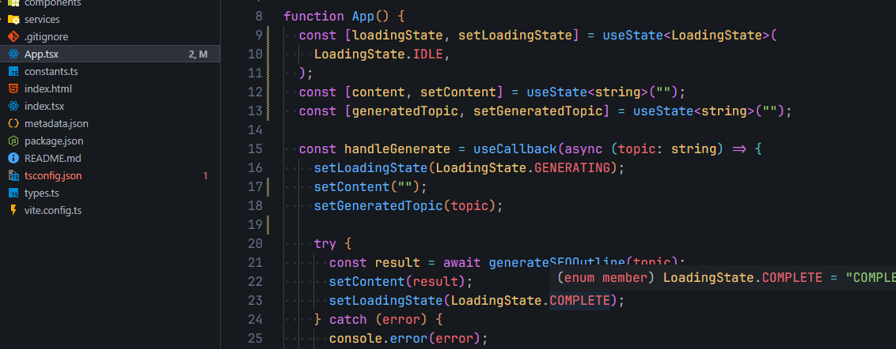

# ⚙️ pNetwo VS Code Settings

Este repositório contém meu `settings.json` pessoal. Meu ambiente foi desenhado para **alta produtividade** e **facilidade de leitura**, utilizando recursos modernos do VS Code para entender o código mais rápido.

> **Foco:** Javascript (React/Node), Python e Desenvolvimento Guiado por IA.

## 🎨 Visual & Imersão
Configuração visual limpa, com transparência e ícones modernos.

* **Tema:** `One Dark Pro Night Flat` (Variação com cores mais "chapadas" e modernas)
* **Ícones de Arquivo:** `Material Icon Theme`
* **Ícones da Interface:** `Fluent Icons` (Deixa a UI do VS Code mais elegante)
* **Fonte:** `JetBrains Mono` (16px, Ligaduras ativadas)
* **Efeito Glass:** `GlassIt-VSC` (Transparência nível 241)
* **Detalhes:**
  * `Render Whitespace`: Boundary (Ajuda a ver espaços desnecessários)
  * `Cursor Smooth`: Animação suave ao digitar

## 🚀 Funcionalidades de Aprendizado (DX)
Ativei recursos visuais que ajudam a entender a estrutura do código sem perder o contexto:

* **Sticky Scroll:** O cabeçalho da função/classe "cola" no topo da tela enquanto rolo o código. Essencial para arquivos grandes.
* **Inlay Hints:** Mostra dicas de tipos e nomes de parâmetros direto no código (estilo IntelliJ).
* **Terminal Inteligente:** Sugestões e autocomplete ativados direto no terminal integrado.

## 🧠 Inteligência Artificial (AI Stack)
Minha tríade de ferramentas para codar mais rápido:
1. **GitHub Copilot** (Autocomplete geral)
2. **Codeium** (Assistente gratuito e rápido)
3. **Tabnine** (Previsão de código local)

## 🛠 Ferramentas Essenciais
* **Auto Save:** Salva após delay (nunca perco código).
* **Format on Save:** Prettier + Organização de Imports automática.
* **ESLint:** Validação rígida para React/JS.
* **Prisma:** Formatação automática de Schemas.
* **Spell Check:** `cSpell` (Inglês/Português) para evitar erros de digitação.

## 🎮 Discord Rich Presence
Integração que mostra meu status de dev para a comunidade:
* **Status:** "👀 Procurando nos Arquivos..." ou "☕ Código, Café e Pomodoro"

## 📥 Como instalar

1. Copie o conteúdo do arquivo `settings.json` deste repositório.
2. No VS Code, abra a paleta de comandos (`Ctrl + Shift + P`).
3. Digite **"Preferences: Open Settings (JSON)"**.
4. Cole o conteúdo (substituindo o atual).

---
### 📦 Extensões Obrigatórias
Para o setup funcionar como na foto, instale:
* *One Dark Pro*
* *Material Icon Theme*
* *Fluent Icons*
* *GlassIt-VSC*
* *ESLint / Prettier*

---
Made with 💜 by [pNetwo](https://github.com/pNetwo)
